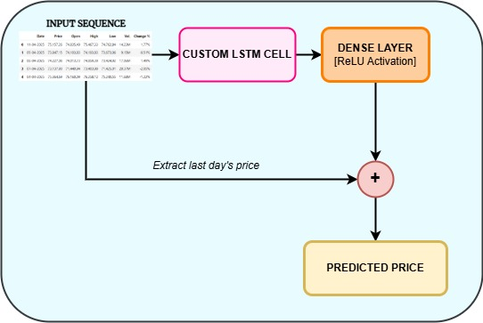
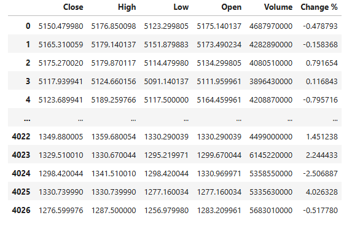
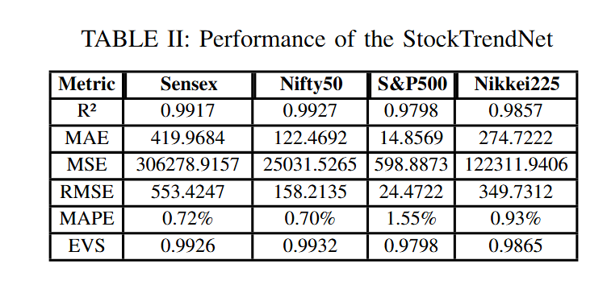
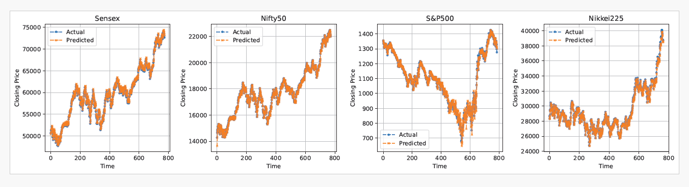

# StockTrendNet – Residual Learning-Based Deep Model for Accurate Stock Price Prediction- Accepted at [CIACON2025](https://ciacon.in/)

Authors :  Soham Mandal , Aritra Chatterjee, Anubhab Bhattacharya, Abir Chakraborty, Utathya Aich and Ram Sarkar

This is the official implementation of "StockTrendNet – Residual Learning-Based
Deep Model for Accurate Stock Price
Prediction".

## Abstract
One of the main components of global finance is the stock market. Predicting future stock market prices with considerable accuracy can provide great insight into market movement and has the potential to generate profit. Among the many metrics used in the stock market, the closing price is one of the two most important, the other
being the opening price. Despite such high importance, it remains difficult to predict the closing price, mainly due to the highly volatile nature of stock prices. To this end, we propose StockTrendNet, a custom Long Short- Term Memory (LSTM)-based model designed to capture
intricate temporal patterns in stock market data, utilizing a gated memory mechanism with update and modulation gates, and incorporating residual and skip connections for enhanced robustness. StockTrendNet has been evaluated on publicly available financial datasets such as Nifty50, Sensex, S&P500, and Nikkei225, showcasing its superior predictive accuracy compared to existing models and positioning it as a robust framework for stock market
forecasting.

### Proposed workflow:

 
 

### Dataset Sample from S&P 500

  

 
 

### StockTrendNet Performance

  

 
 

### Sample StockTrendNet Predictions

  

 
 

## Citation: ( Will be updated )
Please do cite our paper in case you find it useful for your research. 
If you're using this article or code in your research or applications, please consider citing using this BibTeX: 

 
